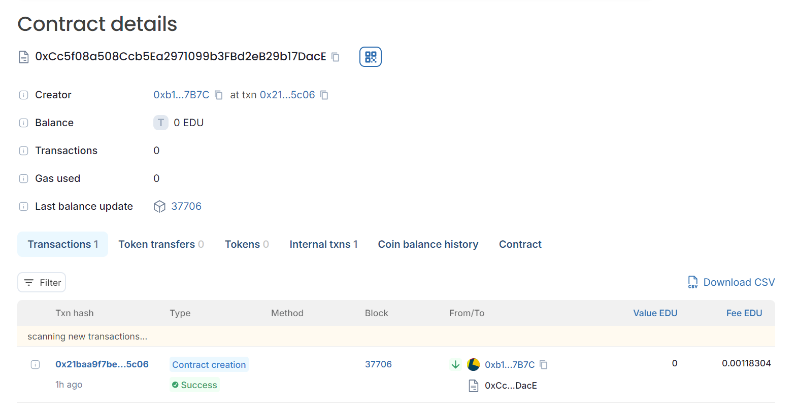

## CourseCompletionBadge Smart Contract
## Vision
The CourseCompletionBadge smart contract is designed to facilitate the issuance and management of digital badges for course completion. These badges serve as proof of accomplishment, allowing individuals to showcase their achievements in a decentralized and verifiable manner. The contract supports two types of badges: Merit and Completion. The Merit badge recognizes exceptional performance, while the Completion badge acknowledges successful completion of a course. The goal is to create a transparent, immutable, and tamper-proof record of educational achievements that can be shared and verified globally.

## Problem Statement
In the traditional educational and training landscape, verifying the completion and merit of courses is often cumbersome, prone to fraud, and lacks transparency. Students may face challenges in proving their accomplishments, while organizations struggle to issue and verify credentials efficiently. The CourseCompletionBadge smart contract addresses these issues by leveraging blockchain technology to create a secure, decentralized, and immutable record of course completions and merits.

## Features
Badge Issuance: Validated instructors can mint two types of badges (Merit and Completion) for students who have completed a course.
Ownership Tracking: The contract maintains a record of badge ownership, ensuring that each badge is uniquely associated with its recipient.
Instructor Management: The admin can validate and revoke instructors, controlling who has the authority to issue badges.
Course Details: The contract stores the details of each course for which a badge is issued, allowing users to retrieve information about their accomplishments.

## How to Use
Deploy the Contract: The contract can be deployed to any Ethereum-compatible blockchain.
Admin Validates Instructors: The admin can validate instructors who are authorized to issue badges.
Instructors Mint Badges: Validated instructors can mint either Merit or Completion badges for students who complete their courses.
Query Badge Details: Users can query the blockchain to verify badge ownership and retrieve course details.
Future Enhancements
Transferability: Add functionality to transfer badges between addresses.
Badge Revocation: Allow instructors or the admin to revoke badges if needed.
Integration with DApps: Develop decentralized applications (DApps) to facilitate interaction with the smart contract.
## Developer details
Name: Harshit Jain

## Deployment 
Chain name:Educhain 
Contract id:-0xCc5f08a508Ccb5Ea2971099b3FBd2eB29b17DacE
